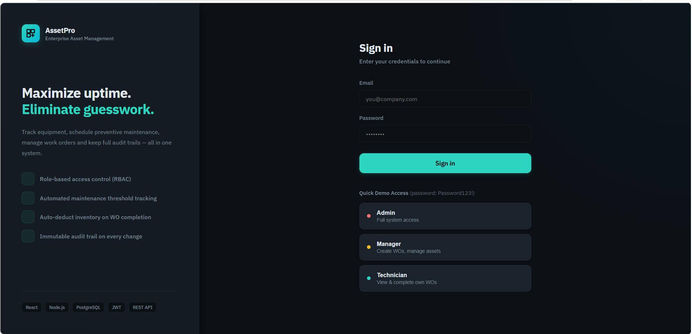
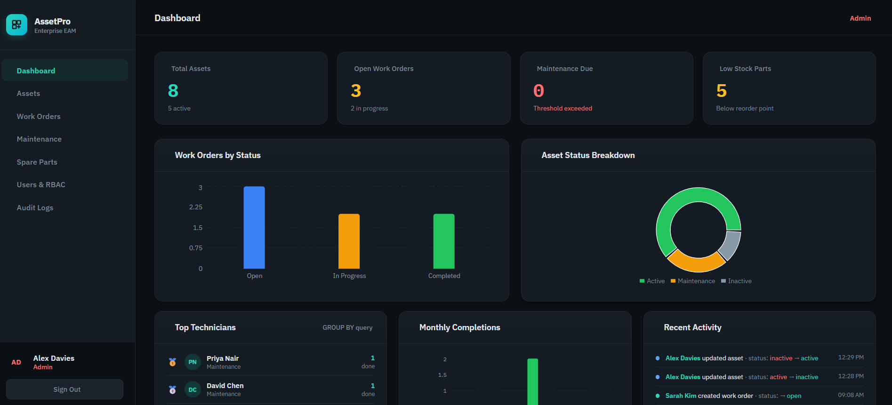
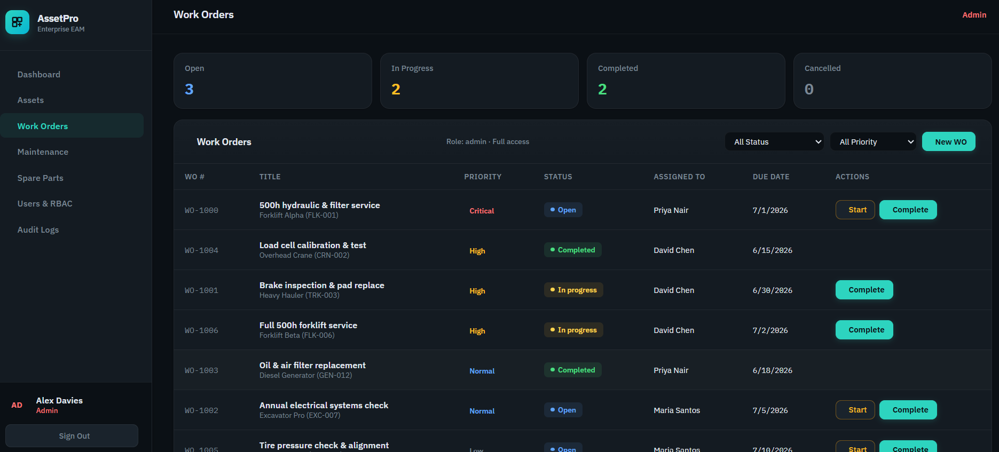

<div align="center">

# ⚙️ AssetPro

### Enterprise Asset Management & Maintenance Tracking System

A production-grade full-stack application demonstrating advanced backend architecture, complex SQL transactions, and strict Role-Based Access Control — built to solve real industrial workflows.

[](https://nodejs.org/)
[](https://react.dev/)
[](https://www.postgresql.org/)
[](https://jestjs.io/)

**[🚀 VIEW THE LIVE APP](https://assetpro-eam-system.vercel.app/)**

</div>

---

## 📸 Application Preview

<table>
  <tr>
    <td>
      
    </td>
    <td>
      
    </td>
    <td>
      
    </td>
  </tr>
  <tr>
    <td align="center">
      <b>Login</b><br>
      Secure JWT-based authentication
    </td>
    <td align="center">
      <b>Admin Dashboard</b><br>
      Aggregated KPIs & system analytics
    </td>
    <td align="center">
      <b>Work Orders</b><br>
      RBAC-enforced creation & atomic completion
    </td>
  </tr>
</table>

---

## 🏢 Enterprise Architecture

This project was built to demonstrate the patterns and strictness required in large-scale enterprise systems, such as IFS Cloud, rather than being a basic CRUD application.

| Feature                       | Implementation Detail                                                                                                                                    |
| :---------------------------- | :------------------------------------------------------------------------------------------------------------------------------------------------------- |
| 🔒 **Atomic Transactions**    | Completing a Work Order runs a `BEGIN/COMMIT/ROLLBACK` block. If part deduction fails, the asset status and audit log roll back too. **All or nothing.** |
| 🛑 **Row-Level Locking**      | Uses `SELECT ... FOR UPDATE` inside transactions to prevent race conditions if two managers complete the same Work Order simultaneously.                 |
| 🛡️ **DB-Level Constraints**  | Uses PostgreSQL `ENUM` types and `CHECK (quantity >= 0)` constraints to guarantee data integrity even if backend logic fails.                            |
| 🕵️ **Immutable Audit Trail** | Every state change (Status, Assignee, Stock Level) is recorded in an append-only `audit_logs` table with `old_value`, `new_value`, and actor.            |
| 🔑 **Strict RBAC**            | Enforced at three levels: UI rendering, JWT Middleware, **and** Service Layer. Technicians cannot change Work Order priority or reassign Work Orders.    |
| 🧪 **Tested Business Logic**  | 12 Jest unit tests covering RBAC edge cases and transaction logic, mocking the database for fast, isolated execution.                                    |

---

## ⚡ The "Magic" — Work Order Completion Transaction

The core of the application is the Work Order completion endpoint. When a technician marks a job as done, the system must maintain absolute data consistency.

Here is what happens inside a single PostgreSQL transaction:

1. **Lock** the Work Order row using `FOR UPDATE` to prevent concurrent modifications.
2. **Check Stock** for required spare parts → Throw `409 Conflict` if insufficient.
3. **Deduct** spare parts from `spare_parts` inventory.
4. **Update** the `assets` table status from `maintenance` back to `active`.
5. **Reset** the `maintenance_schedules.last_service_hours` to the current running hours.
6. **Insert** entries into the immutable `audit_logs` table.
7. **Commit** — or **Rollback** all changes if any step fails.

---

## 🧰 Tech Stack & Architecture

| Layer        | Tech                      | Purpose                                              |
| :----------- | :------------------------ | :--------------------------------------------------- |
| **Frontend** | React 18, Recharts, Axios | Dark-mode enterprise UI, JWT interceptor, RBAC state |
| **Backend**  | Node.js, Express          | REST API, Swagger JSDoc documentation, Rate Limiting |
| **Database** | PostgreSQL                | UUIDs, ENUMs, Triggers, Indexes, Junction Tables     |
| **Auth**     | JWT + bcryptjs            | Stateless Bearer tokens with embedded RBAC roles     |
| **Testing**  | Jest                      | Mocked repository tests for Service layer logic      |

### Backend Architecture Pattern

```text
Controller → Service → Repository → PostgreSQL
```

* **Controllers** handle HTTP requests and responses.
* **Services** handle business rules and RBAC.
* **Repositories** handle raw SQL queries.

---

## 🚦 Getting Started

<details>
<summary><b>⏳ Setup Instructions (Click to expand)</b></summary>

### 1. Database Setup

Open **pgAdmin**, create a database named `assetpro`, open the Query Tool, and run:

```text
docs/schema.sql
```

### 2. Backend Setup

```bash
cd backend
npm install
cp .env.example .env
```

Edit `.env` and add your PostgreSQL password.

Then run:

```bash
node src/config/seed.js
```

This seeds realistic demo data including Users, Assets, Parts, and Work Orders.

Start the backend:

```bash
npm run dev
```

Backend runs on:

```text
http://localhost:5000
```

### 3. Frontend Setup

Open another terminal:

```bash
cd frontend
npm install
npm run dev
```

Frontend runs on:

```text
http://localhost:3000
```

### 4. Run Tests

```bash
cd backend
npm test
```

This runs the Jest unit tests.

</details>

---

## 🔑 Demo Accounts

The seed script creates three roles with varying permissions.

**Password for all accounts:** `Password123!`

| Role              | Email                  | Capabilities                                                      |
| :---------------- | :--------------------- | :---------------------------------------------------------------- |
| 👑 **Admin**      | `admin@assetpro.com`   | Full system access, User management, All CRUD                     |
| 🟡 **Manager**    | `manager@assetpro.com` | Create Work Orders, Assign Technicians, Inventory control         |
| 🟢 **Technician** | `priya@assetpro.com`   | View/Complete **own assigned Work Orders only**, Read-only assets |

---

## 📚 API Documentation

Once the backend is running, access the interactive Swagger UI:

**http://localhost:5000/api-docs**

You can use the **Authorize** button in Swagger and paste a JWT token to test protected endpoints directly.

---

## 📁 Project Structure

```text
assetpro/
├── backend/
│   ├── src/
│   │   ├── config/          # DB pool, seed data, Swagger setup
│   │   ├── middleware/      # JWT verification + RBAC role checker
│   │   ├── repositories/    # Parameterized SQL queries (No ORM)
│   │   ├── services/        # Business logic + transaction blocks
│   │   ├── controllers/     # HTTP request/response handling
│   │   └── routes/          # Express routes + Swagger JSDoc
│   └── tests/               # Jest setup + Service layer tests
│
├── frontend/
│   └── src/
│       ├── context/         # React Auth context
│       ├── services/        # Axios + Bearer token interceptor
│       └── pages/           # Login, Dashboard, Assets, Work Orders,
│                            # Maintenance, Parts, Users, Audit
│
└── docs/
    └── schema.sql           # PostgreSQL schema
```

---

## 📌 Key Highlights

* Enterprise-style layered backend architecture
* PostgreSQL transaction management
* Row-level locking with `FOR UPDATE`
* Strict Role-Based Access Control
* JWT authentication
* Immutable audit logging
* Database-level integrity constraints
* Inventory and spare-part management
* Maintenance scheduling
* Work Order lifecycle management
* Swagger API documentation
* Jest unit testing
* React-based enterprise dashboard

---

## 👨‍💻 Project Purpose

AssetPro was developed as a practical demonstration of building a robust Enterprise Asset Management system with a strong focus on **data integrity, security, maintainability, and transactional business logic**.

---
